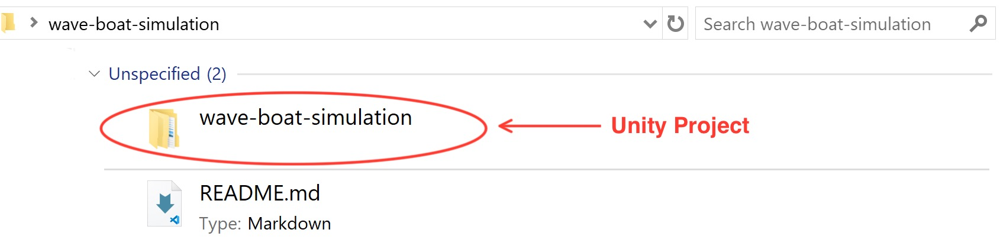
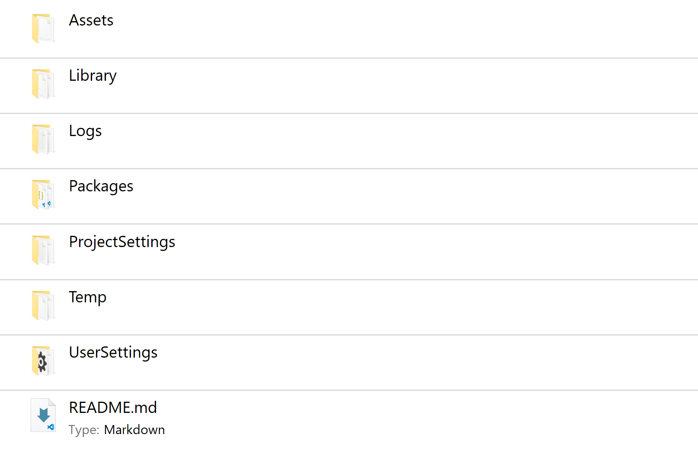

# Wave & Boat (Initial Test)

This `branch` is used to **test** how to upload a Unity project into GitHub successfully without doing a ***subfolder method***.

###### Subfolder Method:

###### Thus, I think it would be better if I show the steps to upload a Unity project here in this README, which benefits both me and other learners who are curious on that.

## Steps

1. ***Create*** a Unity project somewhere on your computer, and give it the same name as your repo's. **(C:\Users\ `your-pc-name` \Desktop\Git\ `your-repo-name`)**
2. After the build is complete, ***cut-and-paste*** everything from the Unity project into another temporary folder, which is under the same directory. **(C:\Users\ `your-pc-name` \Desktop\Git\ `temp-folder`)**
3. ***Clone*** your repo into the empty folder you left that has the same name as your project's. **(C:\Users\ `your-pc-name` \Desktop\Git\ `your-repo-name`)**
4. Once the repo is cloned, ***cut-and-paste*** everything from the temporary folder back into the original folder. **(But this time, the original folder can be recognized as both a Unity project and a cloned repo!)**
5. ***Test to see*** if the Unity project can be launched... (It should succeed.)

###### Not a Subfolder Method:

