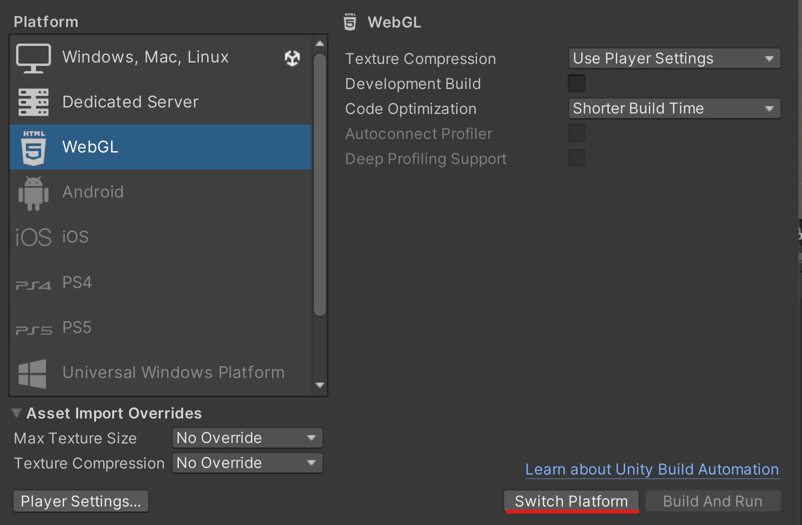
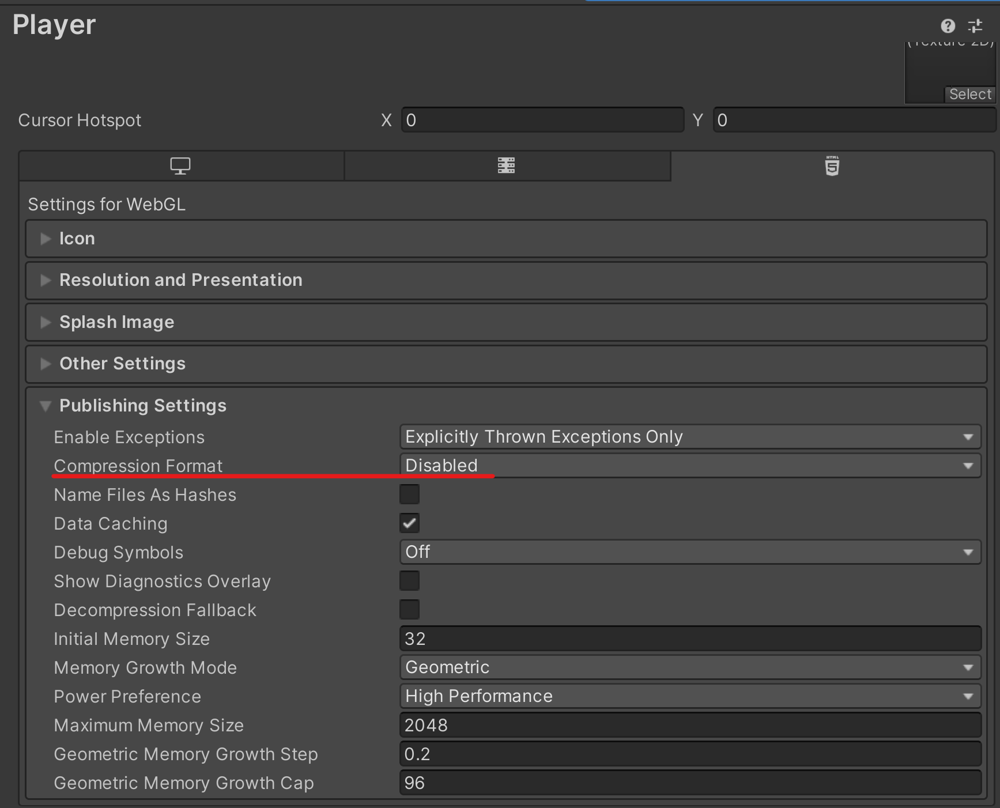

# Wave & Boat (WebGL Test)

###### This branch should have no different source codes than the `main` branch...

This `branch` is used to **test** if the WebGL folder I built based on this project can be run and deployed on GitHub Pages successfully. (This is also what I did for `main` branch...)  

###### Again, I think it would be better if I show the steps of how to build a project in WebGL using Unity, which benefits both me and other learners who want to know how to deploy their game on website.

> ##### "Here we go again..."

## Steps

1. Go to **"File" → "Build Settings..."**.
2. Select **"WebGL"** and click **"Switch Platform"**.

> 

3. **Wait** until the compiling progress is complete...
4. Once it is complete (And the "Build Settings" window is still up), click **"Player Settings..."**, find **"Publishing Settings" → "Compression Format"** and select ***"Disabled"*** instead. (You will then get the raw files/folders after the build, which is easier to copy-and-paste into GitHub.)

> 

5. Close "Player Settings" window, click **"Build"** and select the location you want.
6. **Navigate to the folder** where you saved the build, you should see something like this:

> 

7. **Put everything** from that folder into your cloned repo, then you can push the changes and deploy the webpage.

###### (`My last note`: Hope you have had fun by checking through all my *branches* in order patiently!)
