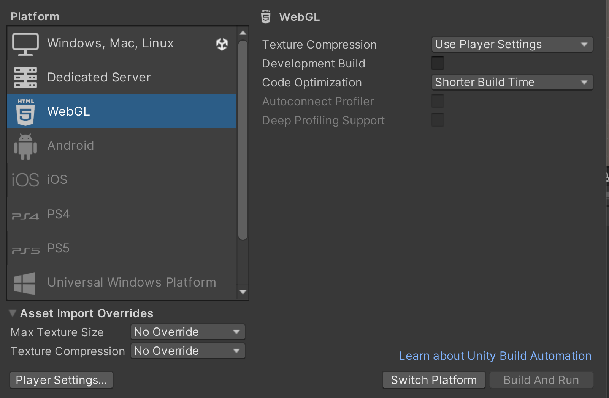
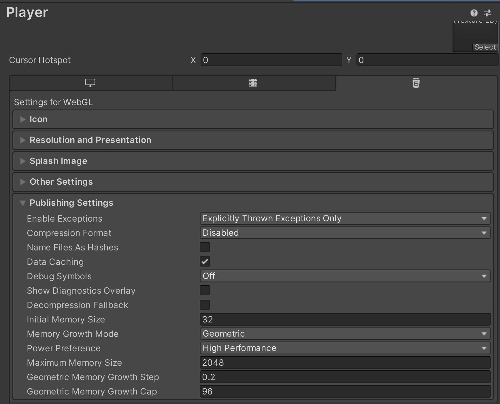
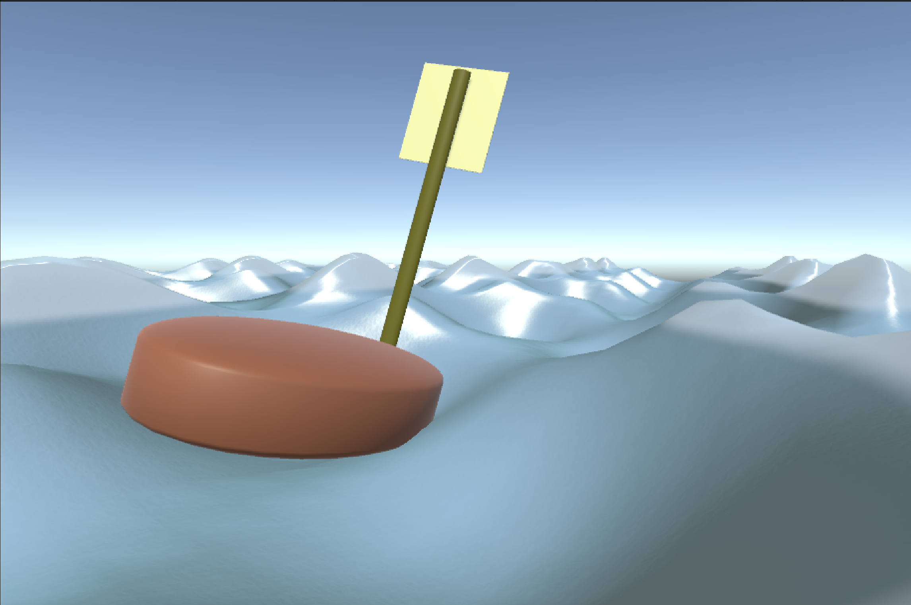

###### Belows are my instructions and notes for every user (*player*)  who wants to know more.

# Wave & Boat

Hi, welcome to my "Water & Boat" water simulation demo.

I would rather call it a GAME demo as it is quite fun to...

> ##### **"Enough! We have already seen these sentences in your demo, show something new in your source code website."**

Okay, **new stuffs**: 

This is my first individual **Unity** project, the idea was from one of my university courses (which I will talk more in the section `Stories Behind the Work`).

*(If you are good at **Unity**, you can probably build a better version by using better models from **Unity Asset Store** and/or manually apply more add-ons.)*

However, I learned to use **coding** to generate a natural dense water surface from scratch, which includes **custom** grid mesh, Gerstner motion, surface lighting and object response.

And this should make my project unique enough from many other demos online. *(Hopefully...)*

## Features

###### I have provided some tips in the game demo, but it looks like the window space was compromised, so I have to list more here:

1. See what happens when you do **right click and drag**.
2. See what happens when you **scroll the wheel**.
3. If you think the **tips window** is annoying, *there is a way to close it*.
4. The **text** at the bottom of the game demo **is clickable**. 

## Installation

You do not need to install anything to run this game demo, just click on the link given [here](https://2h-5.github.io/wave-boat-simulation/). Do not worry, this link is not malicious as I deployed it using **GitHub Pages**.

## Stories Behind the Work

This project's main idea was from the final project of one of my university courses —— Computer Graphics. 

The course taught some basic theories like rastering, buffering and rendering. This project is applying those theoratical portion into application, where the game engine and coding part was self-learned.

Compared to my original final project, what I have further developed are:

1. Apply normal reconstruction for additional normal map detail blended in the fragment shader.
2. Apply extra codings that can add scaled height to break visual regularity, which create a more complex and natural surface motion.
3. Add annotations for better explanation inside the demo.

## Screenshots

